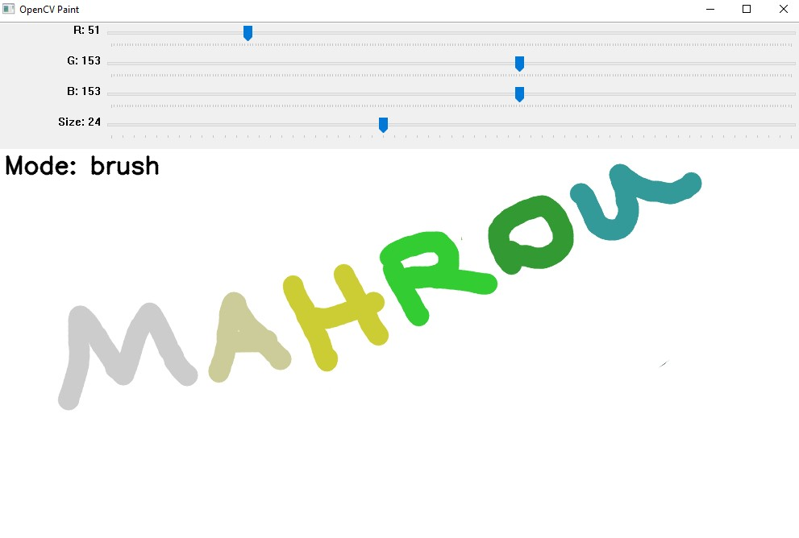

# OpenCV Paint 🎨

A simple Paint-like drawing program built with **Python + OpenCV**.  
Draw on a white canvas using your mouse, change brush **color** and **size** with trackbars, switch to an **eraser**, clear the screen, and save your artwork.

---

## Features

- ✅ Smooth freehand drawing (anti-aliased lines)
- 🎚️ 4 Trackbars:
  - **R** — Red channel (0–255)
  - **G** — Green channel (0–255)
  - **B** — Blue channel (0–255)
  - **Size** — Brush thickness (5–60)
- 🧽 Eraser mode (draws with white color)
- 🧼 Clear canvas
- 💾 Save drawing to PNG with timestamp
- ⌨️ Simple keyboard controls
- 🟦 **NEW:** Live color preview box showing the current brush color

---

## New Update (v1)

### Live Color Preview
A small square is displayed on the top-left of the window that always shows the **current brush color** selected from the RGB trackbars.  
This makes it easier to see the exact color before drawing, especially when switching between brush and eraser.

**How it works (in code):**
- The program reads current R/G/B values every frame.
- It draws a filled rectangle using that color on a copy of the canvas (`display`), so the preview does **not** affect your drawing.

---
## Demo



---
## Requirements

- Python 3.7+
- OpenCV
- NumPy

Install dependencies:

```bash
pip install opencv-python numpy


